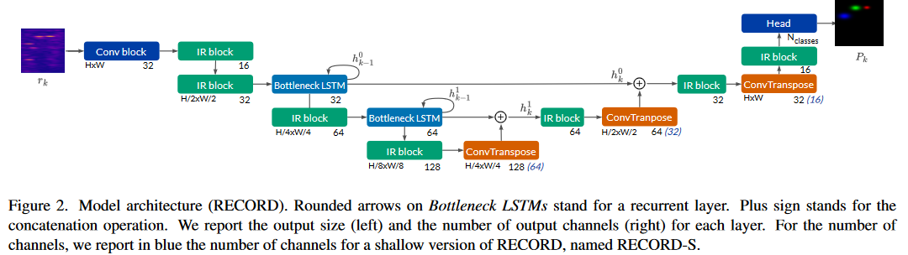
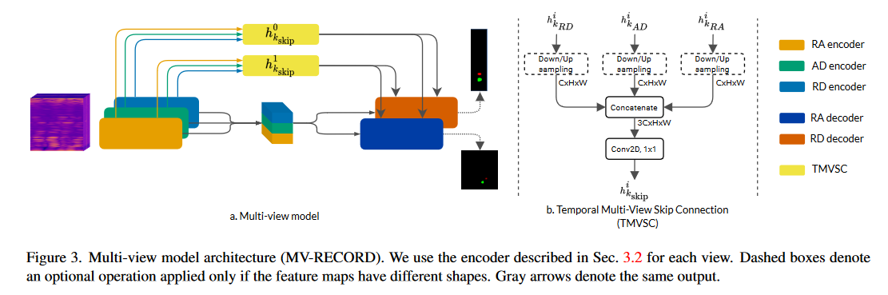

# RECORD- A recurrent CNN for online object detection on raw radar frames


Implementation of RECORD model, from the paper [*A recurrent CNN for online object detection on raw radar frames*](https://arxiv.org/abs/2212.11172v2).  

**DISCLAIMER: The code of RECORD can only be used for academic purposes.**

If you find this code useful for your research, please cite our [paper](https://arxiv.org/abs/2212.11172v2): 
```bibtex
@article{decourt2022recurrent,
  title={A recurrent CNN for online object detection on raw radar frames},
  author={Decourt, Colin and VanRullen, Rufin and Salle, Didier and Oberlin, Thomas},
  journal={arXiv preprint arXiv:2212.11172},
  year={2022}
}
```

## Contents 

We provide in this repository: 
* RECORD model implementation (*buffer* and *online* implementation)

* MV-RECORD model implementation

* Pre-trained weights of models

## Demo

### Predictions on ROD2021 validation set  


### Predictions on CARRADA test set  


## Pre-processing steps

### Reorganize ROD2021 dataset folder (only if you want to use the ROD2021 dataset)
We recommend to apply the same processing steps as [RODNet](https://github.com/yizhou-wang/RODNet/).  
Download [ROD2021 dataset](https://www.cruwdataset.org/download#h.mxc4upuvacso).

To reorganize files in train, valid and test folders, run:
```commandline
bash ops/reorganize_rod2021.sh 
```

### Prepare ROD2021 data

Convert data and annotations to `.pkl` files (once). The train and valid sequences are set in the configuration files.

```commandline
python ops/prepare_data.py \
        --config configs/cruw/config_record.yaml \
        --data_root <DATASET_ROOT> \
        --split train,valid,test \
        --out_data_dir data/<DATA_FOLDER_NAME>
```

There is no required pre-processing steps for CARRADA dataset (except to [download it](https://arthurouaknine.github.io/codeanddata/carrada)).

## Installation

### Using Docker
We **strongly** recommend to use Docker to run and eval the models. We provide a [Dockerfile](Dockerfile). 
First, clone the repository: 
```commandline
git clone https://github.com/colindecourt/record.git
```

Build the docker image:
```commandline
docker build . -t "record:1.0"
```

Run a container
```commandline
sudo docker run --network=host --ipc=host -d -it --gpus all --name record -v <path_to_carrada>:/home/datasets/Carrada -v <path_to_rod2021>:/home/datasets/ROD2021 -v <path_to_logs>:/home/logs -v <path_to_prepared_data>:/home/datasets/cruw_prepared record:1.0 sleep infinity
```

Start a bash session in the container
```commandline
sudo docker exec -it record bash
```
You should be able to run and eval models according to the instructions bellow (see [training section](#train-models)).

### Without Docker

Create a conda or virtualenv environment for RECORD. 

**With conda**  

```
conda create -n record python=3.* 
conda activate record
```

Install required packages

`pip3 install -r requirements.txt`

Install cruw-devkit

```
git clone https://github.com/yizhou-wang/cruw-devkit.git
cd cruw-devkit
pip3 install .
cd ..
```

Setup RECORD package

`pip3 install -e .`

### Update config files

We use `.yaml` configuration files to train models. These configuration paths contains path to datasets. You can
automatically update these configuration files with your path with:
```commandline
# We recommand to use absolute paths
python ops/config_paths.py \
        --configs_path <path_to_record>/configs # path to configuration files \
        --backbone_path <path_to_record>/models/configs # path to model configuration files \
        --ckpt_path logs/ # path to the folder with logs \
        --rod_base_root <path_to_rod2021_dataset> \
        --rod_data <path_to_prepared_data> # e.g. data/<DATA_FOLDER_NAME> \
        --carrada_base_root <path_to_carrada_dataset \
```

#### Train models

##### ROD2021

Once you've update the configuration files, to train RECORD *buffer* model run:
```commandline
python main_cruw.py --config configs/cruw/config_record_cruw.yaml --test_all
```

To train RECORD *online* model run:
```commandline
python main_cruw_oi.py --config configs/cruw/config_recordoi_cruw.yaml --test_all
```

##### CARRADA dataset

We provide training scripts for multi view and single view models.

###### Multi view models 

To train MV-RECORD *buffer* model run:

```commandline
python main_carrada.py --config configs/carrada/config_mvrecord_carrada.yaml
```

To train MV-RECORD *online* model run:

```commandline
python main_carrada_oi.py --config configs/carrada/config_mvrecordoi_carrada.yaml
```

###### Single view models

To train RECORD *buffer* model on RD/RA view only:

```commandline
python main_carrada.py --config configs/carrada/config_record_<view>_carrada.yaml 
```
Where *view* is **ra** or **rd**. 

To train RECORD *online* model on RD/RA view only:

```commandline
python main_carrada_oi.py --config configs/carrada/config_recordoi_<view>_carrada.yaml 
```
Where *view* is **ra** or **rd**.


## Eval models

By default, evaluation is done after training. But you can use the provided weights to evaluate RECORD models.

The logs have the following structure:
```
- logs
  |-- rod2021
    |-- RECORD
      |-- version_0
      |-- ...
      |-- version_i
    |-- RECORD-S
      |-- version_0
      |-- ...
      |-- version_i
    |-- ...
  |-- carrada
    |-- MV-RECORD
      |-- version_0
      |-- ...
      |-- version_i
    |-- MV-RECORD-S
      |-- version_0
      |-- ...
      |-- version_i
    |-- ...
```

### Evaluate on ROD2021 dataset 

Unzip the logs file at the location you want. For the *buffer* variant run:

```commandline
python eval_cruw.py --config ./configs/cruw/config_<model_name>.yaml \
                     --log_dir <path_to_logs>/rod2021 \ 
                     --version version_<i> \ # the version to evaluate, default is 'version_0'
                     --ckpt <path_to_logs>/<dataset_name>/<model_name>/version_<i>/<ckpt> \
                     --test_all
```

For the *online* variant: 
```commandline
python eval_cruw_oi.py --config ./configs/cruw/config_<model_name>.yaml \
                     --log_dir <path_to_logs>/rod2021 \ 
                     --version version_<i> \ # the version to evaluate, default is 'version_0'
                     --ckpt <path_to_logs>/<dataset_name>/<model_name>/version_<i>/<ckpt> \
                     --test_all
```

Use the `--test_all` argument to evaluate on the validation and the test sets. Use the `--test_on_val` argument
to evaluate on the validation set only. Otherwise, it will evaluate on the test set. 

To evaluate the test set on the [ROD2021 evaluation platform](https://codalab.lisn.upsaclay.fr/competitions/1063) run:

```commandline
python ops/convert_to_rod2021.py --rodnet_res_dir <path_to_logs>/<dataset_name>/<model_name>/version_<i>/test/ \
                                 --convert_res_dir <path_to_logs>/<dataset_name>/<model_name>/version_<i>/test-convert/ \
                                 --archive_dir <path_to_logs>/<dataset_name>/<model_name>/version_<i>/>archive_name>
                                 --data_root <path_to_rod2021_dataset>
```
Then upload to `.zip` file on the evaluation platform.

### Evaluate on CARRADA dataset

To evaluate *buffer* models on CARRADA dataset, run:

```commandline
python eval_carrada.py --config ./configs/carrada/config_<model_name>.yaml \
                       --log_dir <path_to_logs>/carrada \
                       --version version_<i> \ # the version to evaluate, default is 'version_0'
                       --ckpt <path_to_logs>/<dataset_name>/<model_name>/version_<i>/<ckpt> \
```

To evaluate *online* models on CARRADA dataset, run:

```commandline
python eval_carrada_oi.py --config ./configs/carrada/config_<model_name>.yaml \
                       --log_dir --log_dir <path_to_logs>/carrada \
                       --version version_<i> \ # the version to evaluate, default is 'version_0'
                       --ckpt <path_to_logs>/<dataset_name>/<model_name>/version_<i>/<ckpt> \
```

Then launch a Tensorboard instance to see the results.

## Note about configuration files

You'll find in the `models/configs` folder configuration files for each model. These configuration files are `.yaml`
files which describe the structure of the network such as:
```yaml
#  describe the name of the model
config_name: name
# describe the configuration of the recurrent convolutional encoder
encoder_config:
  # Describe the layer name
  layer1_name:
    # type of layer (conv, inverted residual, bottleneck lstm etc.)
    type: type_of_layer # str, required
    in_channels: num_input_channels # int or expression such as an addition, required
    out_channels: num_out_channels # int or expression such as an addition, required
    stride: stride_val # int, optional 
    kernel_size: size_of_kernel # int/list/tuple, optional
    ...
  layer_2_name:
    ...

# describe the configuration of the decoder
decoder_config:
  ...
```
For simplicity and readability, models are manually build using the configuration file but could be automatically build 
using the `models.record.build_model` function. 
Configuration files are mostly use to describe the architecture, change the number of input/output channels, kernel size, 
expansion factor, stride per layer... 

*Supported operations: BottleneckLSTM, InvertedResidual, Conv3x3ReLUNorm, torch.nn.Conv2d, torch.nn.ConvTranspose2d*
